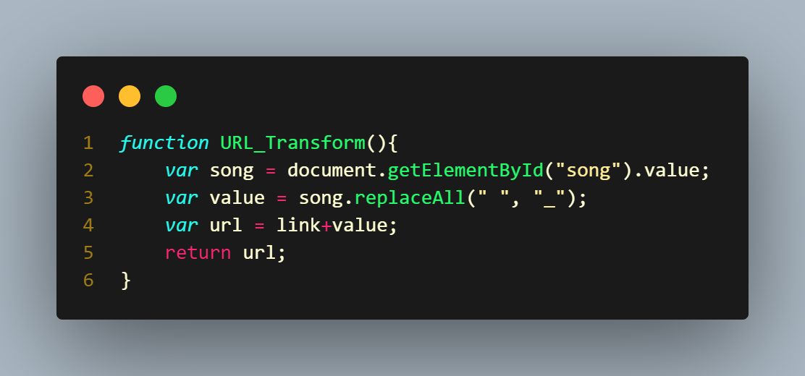

# Uso de Cors
Una práctica de Express.js en la que se consume una API personal

## ¿Como funciona?
El programa hace uso de Express.js para hacer una pequeña API sobre álbumes de música (todos los albumes de The Strokes están agregados por defecto)

Los espacios son manejados por la funcion **URL_Transform** para crear las rutas hacia los datos agregados.
~~___________________________________________________________________________________________________________________~~
# Cors Usage
An Express.js proyect to practice personal API consumption

## How does it work?
The program makes use of Express.js to create a small API about music albums (all of The Strokes' albums are added by default)

The spaces are handeled by the **URL_Transform** to create the paths to the added data

~~___________________________________________________________________________________________________________________~~

# Use instructions / Instrucciones de uso
- Clone this repo.
- Run **npm install** on the *APIs* folder to add the node modules.
- Run **nodemon index.js** in said folder to start the server.
- Open **index.html** in the *APIs_Client* folder on your browser.
